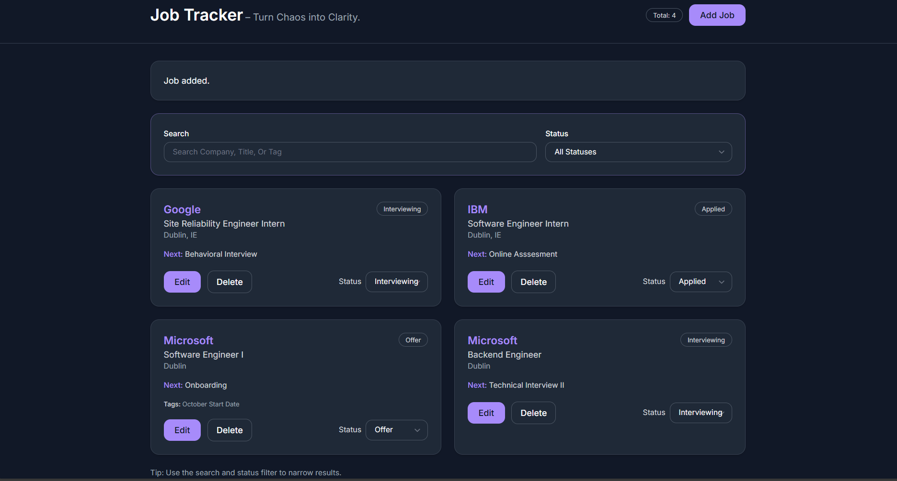
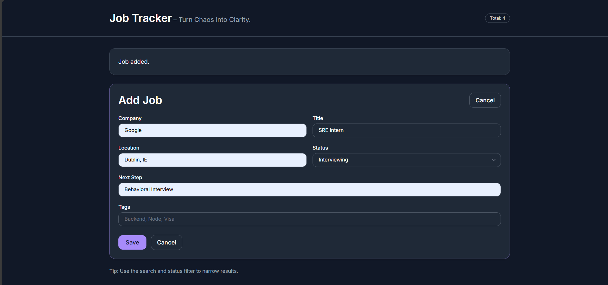
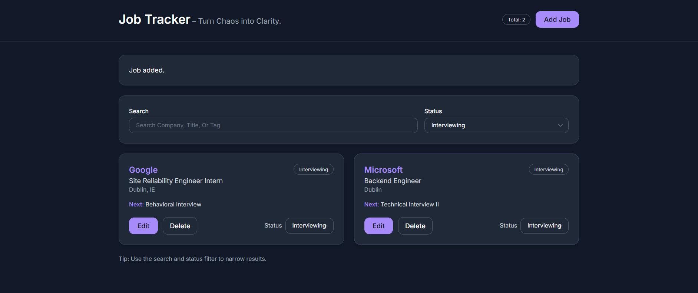
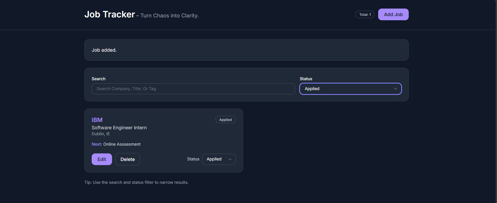

# Job-Tracker-App  
Full-stack web app to manage and track job applications. Built with React, Node.js, and MongoDB, featuring CRUD, filters, and live deployment on Netlify + Render.

A modern full-stack web application for managing and tracking job applications more efficiently than spreadsheets.  
Developed as part of a postgraduate coursework project to demonstrate full-stack development, RESTful API design, and production deployment.

---

## Live Demo

- **Frontend (React App):** [https://fullstack-jobtracker.netlify.app/](https://fullstack-jobtracker.netlify.app/)  
- **Backend API (Express Server):** [https://full-stack-job-tracker.onrender.com/](https://full-stack-job-tracker.onrender.com/)

---

## Overview

The **Job Tracker** allows users to add, edit, and delete job applications while maintaining a structured overview of their progress across different stages such as *Applied*, *Interviewing*, and *Offer*.  

It replaces static Excel sheets with an interactive, database-driven interface that helps users visualize and manage their job search in real time.

---

## Features

- Clean, responsive dark-themed interface built with React and TailwindCSS  
- Add, edit, and delete job applications dynamically  
- Filter and search applications by company, title, or status  
- Persistent data storage using MongoDB Atlas  
- RESTful API built with Node.js and Express.js  
- Deployed using Render (Backend) and Netlify (Frontend)  
- Secure environment variable configuration for production builds  

---

## System Architecture

The system follows a modular client-server architecture:
```
React (Vite)
│
│ REST API Calls (Axios / Fetch)
▼
Node.js + Express.js
│
▼
MongoDB Atlas
```

The backend provides RESTful endpoints for CRUD operations on job entries.  
The frontend consumes these endpoints dynamically to display and manage user data.

---

## Technology Stack

| Layer | Technology |
|-------|-------------|
| **Frontend** | React (Vite), TailwindCSS |
| **Backend** | Node.js, Express.js |
| **Database** | MongoDB Atlas |
| **Deployment** | Netlify (Frontend), Render (Backend) |
| **Version Control** | Git, GitHub |

---

## Screenshots

### Dashboard View


### Add Job Form


### Filters 




---

## Local Development Setup

### Prerequisites
- Node.js (v20 or higher)
- npm
- MongoDB Atlas account (or local MongoDB instance)

### Installation Steps

1. **Clone the repository**
   ```bash
   git clone https://github.com/saniyabhargava/full-stack-job-tracker.git
   cd full-stack-job-tracker
   ```
Backend Setup

```
cd server
npm install
cp .env.example .env

# Add your MongoDB connection string and frontend origin in .env
MONGODB_URI=<your_mongodb_uri>
CLIENT_ORIGIN=http://localhost:5173
NODE_ENV=development

# Start the backend:
npm run dev
```
Frontend Setup
```
cd ../client
npm install
cp .env.example .env

# Update .env:
VITE_API_BASE_URL=http://localhost:4000

# Start the frontend:
npm run dev
```

### Access the Application
- **Frontend:** [http://localhost:5173](http://localhost:5173)  
- **Backend API:** [http://localhost:4000/api/jobs](http://localhost:4000/api/jobs)

---

## Deployment Configuration

### Netlify (Frontend)
- **Base Directory:** `client`
- **Build Command:** `npm run build`
- **Publish Directory:** `dist`
- **Environment Variable:**  
  `VITE_API_BASE_URL=https://full-stack-job-tracker.onrender.com`

### Render (Backend)
- **Root Directory:** `server`
- **Build Command:** `npm install`
- **Start Command:** `node server.js`
- **Environment Variables:**  
  - `MONGODB_URI=<your_mongodb_uri>`  
  - `NODE_ENV=production`  
  - `CLIENT_ORIGIN=https://fullstack-jobtracker.netlify.app`

---

## Key Learnings and Focus

This project emphasizes:

- Scalable full-stack architecture design  
- End-to-end CI/CD deployment pipeline using Render and Netlify  
- RESTful API design principles and data persistence  
- Modern UI/UX implementation with TailwindCSS  
- Environment variable and configuration management  
- Real-world debugging and performance optimization (CORS, API routing, build pipelines)

---

## Future Improvements

- JWT-based user authentication and secure login system  
- Resume upload and parsing for automatic job entry creation  
- Email and notification reminders for interview dates  
- Application analytics dashboard with data visualization  

---

## Author

**Saniya Bhargava**  
MSc Computer Science, University College Dublin  

[LinkedIn](https://linkedin.com/in/saniyabhargava) • [GitHub](https://github.com/saniyabhargava)
